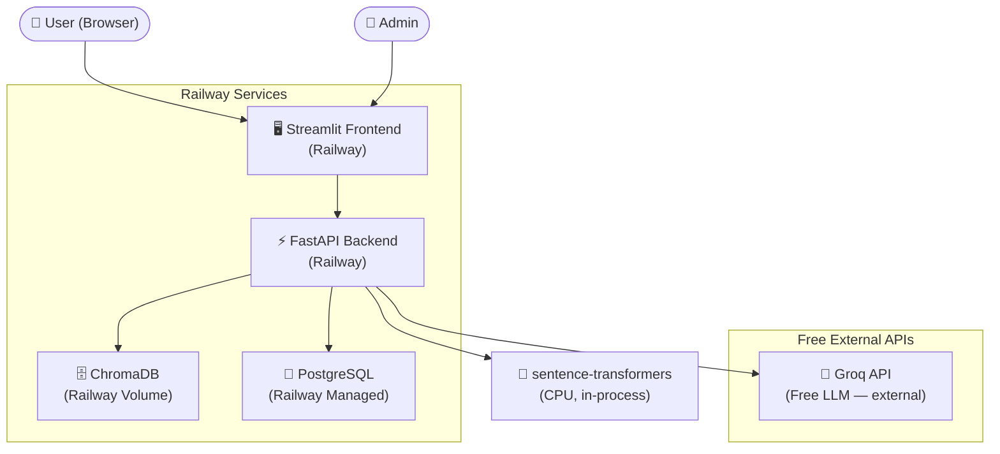

# 🤡 F.A.L.T.U

> **F**antastically **A**ccurate **L**anguage & **T**hinking **U**nit
>
> *An AI chatbot that's definitely NOT useless (despite the name).*
> Upload your docs, ask questions, get cited answers — free, fast, and funny.

[](https://railway.app/new/template)

---

## ✨ What It Does

| Feature | Details |
|---------|---------|
| 📄 **Document Ingestion** | Upload PDF, Word, Markdown, TXT |
| 🔍 **Hybrid Search** | Vector (ChromaDB) + BM25 keyword — best of both |
| 🎯 **Reranking** | Cross-encoder re-scores results for accuracy |
| 💬 **Streaming Chat** | Token-by-token streaming via Server-Sent Events |
| 📚 **Citations** | Every answer links to source documents |
| 🔒 **Auth** | JWT login · admin creates accounts (invite-only) |
| 🛡️ **Guardrails** | Prompt injection detection + PII redaction |
| 📊 **Monitoring** | Prometheus metrics + pre-built Grafana dashboard |
| 🕓 **Chat History** | Restore previous sessions from sidebar |

---

## 🏗️ Architecture



---

## 💰 Cost Breakdown

| Component | Service | Cost |
|-----------|---------|------|
| Frontend | Railway free tier | **$0** |
| Backend | Railway free tier | **$0** |
| PostgreSQL | Railway free tier | **$0** |
| ChromaDB | Railway volume | **$0** |
| LLM (LLaMA 3.1 8B) | Groq free tier (14,400 req/day) | **$0** |
| Embeddings | sentence-transformers (runs in backend) | **$0** |
| **Total** | | **$0/month** |

---

## 🚀 Deploy to Railway (5 Steps)

### Prerequisites
- A [GitHub](https://github.com) account (free)
- A [Railway](https://railway.app) account (free)
- A [Groq](https://console.groq.com) API key (free, no credit card)

---

### Step 1 — Get Your Free Groq API Key

1. Go to [console.groq.com](https://console.groq.com)
2. Sign up (free, no credit card)
3. Go to **API Keys** → **Create API Key**
4. Copy the key (starts with `gsk_...`)

---

### Step 2 — Fork This Repository

Click **Fork** at the top of this GitHub page → your own copy at `github.com/YOUR_NAME/rag-chatbot`

---

### Step 3 — Create a Railway Project

1. Go to [railway.app](https://railway.app) → **New Project**
2. Select **Deploy from GitHub repo** → authorize Railway → choose your fork
3. Railway will detect the project structure

---

### Step 4 — Add PostgreSQL

In your Railway project:
1. Click **+ New** → **Database** → **Add PostgreSQL**
2. Railway automatically injects `DATABASE_URL` into all services — **no action needed**

---

### Step 5 — Set Environment Variables

In Railway dashboard → your **backend** service → **Variables** tab, add:

```bash
# Required
GROQ_API_KEY=gsk_your_actual_key_here
JWT_SECRET_KEY=run_this_to_generate: python -c "import secrets; print(secrets.token_hex(32))"
ADMIN_USERNAME=admin
ADMIN_PASSWORD=YourStrongPassword123!
ADMIN_EMAIL=you@example.com

# Optional (good defaults already set)
GROQ_MODEL=llama-3.1-8b-instant
ENABLE_SEMANTIC_CACHE=true
ENABLE_RERANKING=true
```

For the **frontend** service, add:
```bash
BACKEND_URL=https://your-backend-url.railway.app
```
> 💡 Find your backend URL in Railway → backend service → **Settings** → **Domains**

---

### ✅ Done!

Railway builds and deploys both services. Visit your **frontend URL** from Railway dashboard.

**First login:** use the `ADMIN_USERNAME` / `ADMIN_PASSWORD` you set above.

---

## 🖥️ Local Development

### Prerequisites
- [Docker Desktop](https://www.docker.com/products/docker-desktop/) installed
- A Groq API key

### Setup

```bash
# 1. Clone the repo
git clone https://github.com/YOUR_NAME/rag-chatbot.git
cd rag-chatbot

# 2. Create .env from template
cp .env.example .env

# 3. Edit .env — add your Groq API key and change passwords
#    GROQ_API_KEY=gsk_...
#    ADMIN_PASSWORD=YourPassword
#    JWT_SECRET_KEY=<generate with: python -c "import secrets; print(secrets.token_hex(32))">

# 4. Start everything
docker compose up --build

# 5. Open your browser
# Chat UI:      http://localhost:8501
# API docs:     http://localhost:8000/docs
# Grafana:      http://localhost:3000  (admin / value of GRAFANA_PASSWORD in .env)
# Prometheus:   http://localhost:9090
```

> ⏳ **First startup takes 3–5 minutes** — Docker downloads and builds the ML models into the image. Subsequent starts are instant.

---

## 📖 Usage Guide

### Uploading Documents

1. Log in as admin
2. Click **📄 Upload Documents** in the sidebar
3. Drag and drop a PDF, Word, Markdown, or TXT file
4. Select which **Knowledge Base** (corpus) to add it to
5. Click **Upload & Ingest** — processing happens in the background
6. Status updates from `⏳ pending` → `🔄 processing` → `✅ ready`

### Chatting

1. Select a **Knowledge Base** in the sidebar
2. Type your question in the chat input
3. The bot streams an answer with source citations
4. Click 👍 or 👎 to give feedback

### Managing Users

Admin dashboard → **Create New User**:
- Set a **username**, **email**, and **password**
- Set **permissions** (which knowledge bases they can access)
- Only admins can create accounts — regular users cannot self-register

---

## 🔧 Configuration Reference

All settings are environment variables. Set them in `.env` (local) or Railway dashboard (production).

| Variable | Default | Description |
|----------|---------|-------------|
| `GROQ_API_KEY` | *(required)* | Your Groq API key from console.groq.com |
| `GROQ_MODEL` | `llama-3.1-8b-instant` | Groq model to use |
| `JWT_SECRET_KEY` | *(required)* | Random 32-char secret for JWT signing |
| `ADMIN_USERNAME` | `admin` | Admin account username |
| `ADMIN_PASSWORD` | *(required)* | Admin account password |
| `ADMIN_EMAIL` | `admin@example.com` | Admin account email |
| `DATABASE_URL` | *(auto-injected by Railway)* | PostgreSQL connection string |
| `RETRIEVAL_TOP_K` | `20` | Chunks retrieved before reranking |
| `RERANK_TOP_K` | `5` | Chunks sent to LLM after reranking |
| `CHUNK_SIZE` | `400` | Target tokens per chunk |
| `CHUNK_OVERLAP` | `60` | Overlap tokens between chunks |
| `ENABLE_SEMANTIC_CACHE` | `true` | Cache similar queries |
| `ENABLE_RERANKING` | `true` | Cross-encoder reranking |
| `ENABLE_PII_REDACTION` | `true` | Redact PII from outputs |
| `RATE_LIMIT_PER_MINUTE` | `20` | Max queries per user per minute |
| `LOG_LEVEL` | `INFO` | Logging verbosity |

---

## 📊 Monitoring (Local Only)

The local Docker Compose stack includes Prometheus + Grafana.

| Service | URL | Credentials |
|---------|-----|------------|
| Grafana | http://localhost:3000 | admin / (GRAFANA_PASSWORD in .env) |
| Prometheus | http://localhost:9090 | none |

The **RAG Chatbot Dashboard** is auto-provisioned with panels for:
- Request rate (req/s)
- P50/P95/P99 latency
- Error rate
- Requests by endpoint and status code

> 💡 Railway has built-in metrics — the Prometheus/Grafana stack is for local monitoring only.

---

## 🛠️ Troubleshooting

### ❌ "Cannot connect to backend" on login
- **Local**: run `docker compose up` and wait for the health check to pass (~60s)
- **Railway**: check backend service logs in Railway dashboard for startup errors

### ❌ "Groq API unavailable" in health check
- Check that `GROQ_API_KEY` is set correctly (starts with `gsk_`)
- Verify at [console.groq.com](https://console.groq.com) that the key is active

### ❌ Empty answers / "I don't have enough information"
- No documents have been ingested yet — upload a document first
- Make sure you're searching the right **Knowledge Base** (corpus)
- Document may still be processing (`⏳ pending`) — wait 30s and retry

### ❌ Slow first response (local)
- First response triggers model loading (~10s for sentence-transformers)
- Subsequent responses are fast (model is cached in memory)
- On Railway this is handled at build time — cold starts are fast

### ❌ "413 File too large"
- Maximum file size is **50MB**
- Split large PDFs using a PDF editor before uploading

### ❌ Railway deployment fails
- Check that `GROQ_API_KEY` and `JWT_SECRET_KEY` are set in Railway Variables
- Check that PostgreSQL plugin is added to the project
- Review build logs in Railway dashboard for dependency errors

### 🔄 Resetting the database (local)
```bash
docker compose down -v   # Removes all volumes including database
docker compose up --build
```

---

## 🏛️ Project Structure

```
rag-chatbot/
├── backend/                    # FastAPI backend
│   ├── main.py                 # App entry point, DB init, scheduler
│   ├── config.py               # Settings (from env vars)
│   ├── models.py               # SQLModel database models
│   ├── auth.py                 # JWT authentication
│   ├── routers/
│   │   ├── chat.py             # POST /v1/chat (streaming SSE)
│   │   ├── ingest.py           # POST /v1/ingest (document upload)
│   │   ├── health.py           # GET /health
│   │   ├── admin.py            # Admin user management
│   │   └── auth_router.py      # POST /auth/login
│   ├── services/
│   │   ├── llm_client.py       # Groq API client (streaming)
│   │   ├── embedder.py         # sentence-transformers embedder
│   │   ├── retriever.py        # Hybrid ChromaDB + BM25 retrieval
│   │   ├── reranker.py         # Cross-encoder reranking
│   │   ├── ingestion.py        # Document parse → chunk → embed → index
│   │   ├── cache.py            # Semantic cache (in-memory TTL)
│   │   └── guardrail.py        # Input/output safety filters
│   ├── Dockerfile
│   ├── requirements.txt
│   └── railway.toml
│
├── frontend/                   # Streamlit chat UI
│   ├── app.py                  # Full UI: login, chat, upload, admin
│   ├── Dockerfile
│   ├── requirements.txt
│   └── railway.toml
│
├── monitoring/                 # Local Prometheus + Grafana
│   ├── prometheus.yml
│   └── grafana/
│       ├── provisioning/       # Auto-config datasources + dashboards
│       └── dashboards/         # Pre-built RAG metrics dashboard
│
├── nginx/
│   └── nginx.conf              # Reverse proxy (local only)
│
├── docker-compose.yml          # Local development stack
├── .env.example                # Environment variable template
├── .gitignore
└── README.md
```

---

## 🤝 Contributing

1. Fork the repository
2. Create a feature branch: `git checkout -b feat/my-feature`
3. Commit your changes: `git commit -m 'feat: add my feature'`
4. Push to the branch: `git push origin feat/my-feature`
5. Open a Pull Request

---

## 📄 License

MIT License — see [LICENSE](../LICENSE) for details.

---

<div align="center">
  Built with ❤️ and questionable naming decisions using FastAPI · Streamlit · Groq · ChromaDB · Railway
  <br/><br/>
  <strong>F.A.L.T.U</strong> — Fantastically Accurate Language & Thinking Unit
  <br/>
  <em>(Yes, we know what "faltu" means. That's the joke.)</em>
</div>
